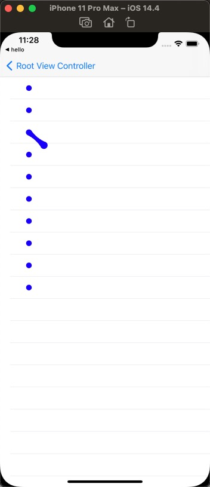

# UsefulWidget

## Introduction
This UsefulWidget has some small controls for use. Now added "Menu","Loading","Drag Dot". Hope everyone increases according to the format.

1. Menu
   

2. Loading 
   

And it is sub of [NVActivityIndicatorView](https://github.com/ninjaprox/NVActivityIndicatorView.git)
  
You can copy code from it as the demo format.  

3. Drag Dot
   
   You can change the color of the dot. and the img of explosion animation should replace too.

